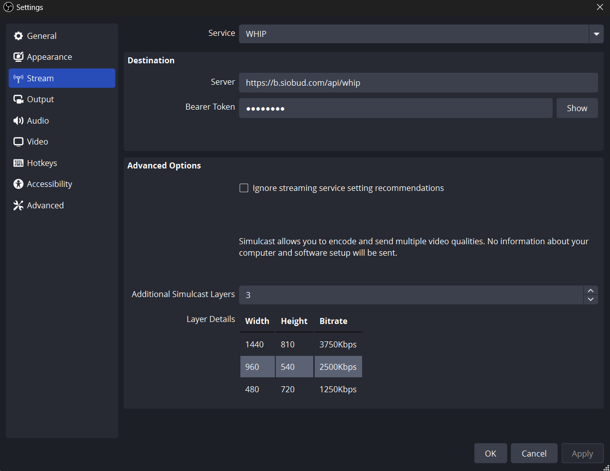

# Summary

Add Simulcast support to WebRTC output.

Simulcast is a WebRTC protocol feature that allows a uploader to send multiple encodes of one track. This is built into the protocol so every WebRTC
ingest already understands this. These layers can be different resolutions, bitrates and even codecs.

# Motivation

The sucess/demand for this feature has already been demonstrated with [Twitch's Multiple Encodes](https://help.twitch.tv/s/article/multiple-encodes).
These are my personal reasons I am working on this.

* **Low Latency** - Transcodes add latency. WebRTC is chosen by OBS users because they want an interactive streams, transcodes break that.

* **Cheaper** - Running a streaming service is expensive. This would allow more streaming services to exist and for more self hosting.

* **Prevent Tampering/Ad Insertion** - WebRTC provides APIs for E2E Encryption. This means a user can upload Simulcast and share the keys viewers. Services can't modify the media anymore.

* **Better Quality** - 'Free Transcodes' is a race to the bottom. Streaming sites do the cheapest/lowest quality possible (to save money). Simulcast gives control to the user.

* **P2P Streaming** - Simulcast + E2E would enable P2P. You can have a mesh of viewers that distribute media to each other. Since things are E2E Encrypted you can detect tampering.

# Design

## Provide a `QSpinBox` with description to configure Simulcast Layers

When users select `WHIP` for their service a description will appear below `Ignore streaming service setting recommendiations`.

This QSBinBox will say `Simulcast Layers`. This value will be 1 by default. This value can be 1 to 4.
The Height/Width/Bitrate of each layer is scaled from the users global choice. So depending on the users choice.

* 1 Layer
  * 100% Height/Width/Bitrate

* 2 Layers
  * 100% Height/Width/Bitrate
  * 50% Height/Width/Bitrate

* 3 Layers
  * 100% Height/Width/Bitrate
  * 66% Height/Width/Bitrate
  * 33% Height/Width/Bitrate

* 4 Layers
  * 100% Height/Width/Bitrate
  * 75% Height/Width/Bitrate
  * 50% Height/Width/Bitrate
  * 25% Height/Width/Bitrate

## Create multiple encoders with the requested settings.

A new member will be added to the `BasicOutputHandler` class. This new member `std::vector<OBSEncoder> simulcastEncoders` will contain
the encoders.

`BasicOutputHandler` will query `SimulcastLayers`. If greater then 0 it will loop and create the encoders.

## Configure PeerConnection in `obs_output_info.start`

`WHIPOutput::Start` will use `obs_output_get_video_encoder2` to query how many encoders exist. It will create a WebRTC offer with the requested details.

This offer contains the number of layers and the bitrate/resolution of them. The server can process this and decide to accept it or reject.

The server may respond with an error that 'Simulcast Configuration was not accepted'. The user can then modify
how many layers they send and try again. Services can configure this ahead of time in OBS.

## Server can reject layers

A server may wish to only accept a subset of the layers offered. Today if the user rejects any layers we throw an error and say how many
layers were accepted. The user can lower the amount of layers they are sending and try again. Services in their documentation will be
expected to tell users how they want video encoded and how many layers they are willing to accept.

# Proposed UX

## Stream Page

## Simple Output Mode

No changes will be made.

## Advanced Output Mode

No changes will be made.

# Alternatives

## Allow users to configure Bitrate/Resolution manually

This would require a large amount of UI work. The consensus was this would be frustrating for users. Nothing stops this from being done in the future though.

## Extend WHIP Protocol to enable 'Server Driven Configuration'

WHIP is an existing protocol with many users of Simulcast already. Something that does 'Server Driven Configuration' could be added to the protocol, but
it would have to be done in a way that doesn't break existing clients. The value/advantage of WHIP is that it maintains compatability with 13 years of WebRTC servers and clients.

This is something we could take to the IETF. I don't anticipate much support since clients already have implemented 'Configuration driven by enviroment' (See point below)

One possibility is `GetClientConfiguration` is opt-in and driven via `services.json`.

## Configuration driven by enviroment

WebRTC clients today configure the amount of layers by observing the enviroment. They measure CPU Load/Network usage and enable layers dynamically. This
is really powerful since the use cases for OBS are so diverse. If someone is streaming a demanding game they will want less layers. If you are just streaming
your desktop you can accomodate more.

This could be possible in the future, but requires a lot more work.

# Drawbacks

## Additional Complexity

Simulcast will add additional code to the OBS code base. If this feature is unused it would be extra burden on the project for no value.

## More Compute/Network Usage

Simulcast will require extra compute and network. If users encounter hardware/network overusage they will need to reduce bitrate/resolution.

In the future I would like to write a dynamic simulcast feature. The WebRTC protocol allows layers to be disabled/enabled at anytime. We could detect network
overusage and disable layers to ensure the streamer has the best experience possible. We would then re-enable them when the network and/or hardware recovers.

I develop and use OBS on a T420 (a laptop from 2011). When streaming using WebRTC and using x264 I see ~6% CPU usage in OBS. With Simulcast enabled I see ~8%. I can gather
more fine performance information if that helps.

# Additional Information

How these layers are played is entirely controlled by the server operator.

With Broadcast Box I provide a drop down so users can explicitly choose the layer they want to watch.

A better implementation would be to dynamically measure the users internet and deliver them the best rendition their internet can support.

Implementation:
* [PR](https://github.com/obsproject/obs-studio/pull/9165)
